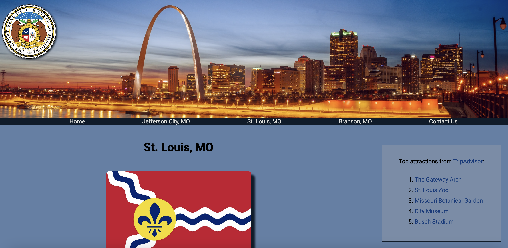

# wgu-fewd

# Front End Web Development Project

Assignment for front end web development class.

## Table of contents

- [Overview](#overview)
  - [Screenshot](#screenshot)
  - [Links](#links)
- [My process](#my-process)
  - [Built with](#built-with)
  - [What I learned](#what-i-learned)
- [Author](#author)

## Overview

### Screenshot

### Links

- Live Site URL: [GitHub Project Page](https://micamash.github.io/wgu-fewd/)

## My process

### Built with

-HTML
-CSS
-Visual Studio Code

### What I learned

-More front end HTML/CSS practice.

## Author

- Website - [My GitHub](https://github.com/micamash)
